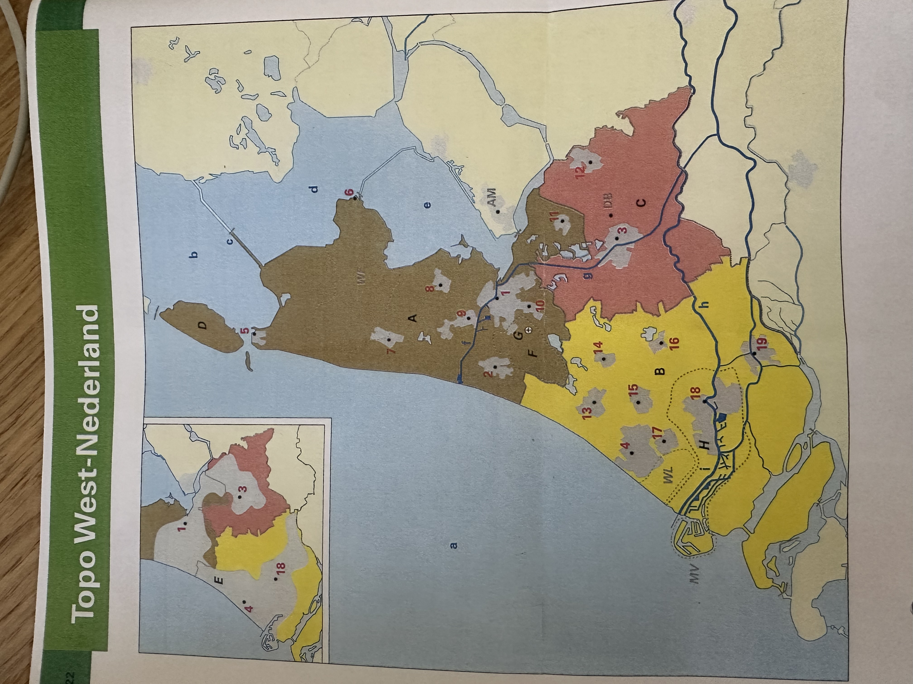

# TopoTrainer.nl 🇳🇱

**TopoTrainer.nl** is a modern, professional, and interactive web application designed to help students master the geography of the Netherlands. It provides a gamified learning experience with a focus on tactile feedback, spatial reasoning, and premium design.

## 🚀 Features

### 🌍 Multi-Region Support
- **West-Nederland:** Master the Randstad, North Holland, South Holland, and Utrecht.
- **Zuid-Nederland:** Explore the provinces of Zeeland, Noord-Brabant, and Limburg.

### 🧠 Advanced Question Engine
- **ID-Based Learning:** Identify locations based on alphanumeric markers (e.g., "Find: A").
- **Spatial Reasoning:** Challenging text-based questions that test your understanding of relative distances and directions (e.g., *"Which city is 25km north east of Tilburg (9)?"*).
- **Dual Modes:** Switch between **Multiple Choice** for guided practice and **Hard Mode** (manual text entry) for expert mastery.

### 🛡️ Gamification & Feedback
- **Life & Shield System:** You start with 3 lives per question. Mistakes trigger a professional "Shield" pop-up, protecting your streak and allowing you to try again.
- **Dynamic Scoring:** Tracks your session score, current streak, and saves your **Best Streak** to local storage.
- **Celebratory Rewards:** Enjoy a colorful balloon animation and success flashes after every correct answer.

### 🌐 Multilingual Support
- Fully localized in **Nederlands** (Default), **English**, and **Türkçe**.
- All labels, instructions, and spatial questions update instantly upon language selection.

### 📱 Premium Design System ("The Cartographic Canvas")
- **Responsive Dashboard:** Optimized for both mobile vertical stacking and desktop side-by-side views.
- **Modern UI:** Built with **Tailwind CSS**, featuring glassmorphism, soft tonal layering, and high-quality typography (Inter).
- **No-Scroll Layout:** Elements are intelligently arranged to fit within the viewport on desktop for a true "dashboard" feel.

---

## 🛠️ Technology Stack
- **HTML5 / CSS3**
- **JavaScript** (Vanilla ES6+)
- **Tailwind CSS** (via CDN)
- **Material Symbols** (Iconography)
- **Levenshtein Distance Algorithm** (For fuzzy matching in Hard Mode)

---

## 📖 How to Use

1.  **Run Locally:** Simply open the `index.html` file in any modern web browser.
2.  **Select Region:** Choose your territory from the interactive Bento-grid entry hub.
3.  **Choose Mode:** Switch between Multiple Choice or Hard Mode using the button in the bottom interaction card.
4.  **Practice:** Click the correct button or type the name. If you have lives, you can retry a question if you miss.
5.  **Menu:** Click the "Menu" icon in the header at any time to switch regions or change languages.

---

## 🚢 Deployment

### GitHub Pages (Recommended)
This application is designed to be hosted easily on GitHub Pages:
1.  Push the `index.html`, `map-west.JPG`, and `map-south.jpg` files to a GitHub repository.
2.  Go to **Settings > Pages**.
3.  Select the `main` branch and click **Save**.

---

## 👤 Author
**Beyazit**

---

*Happy Learning! Succes met oefenen! İyi çalışmalar!*
